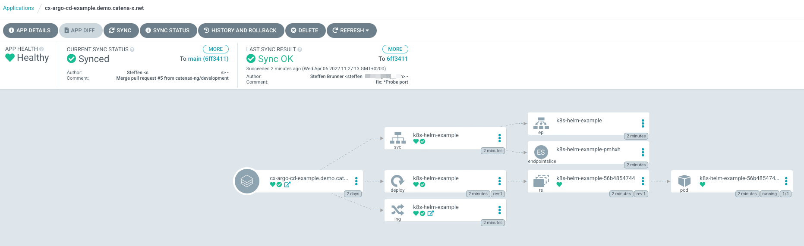

# Introduction

This [repository](https://github.com/catenax-ng/k8s-example-argo-cd-project) is an example on how to build a 
[Docker](https://www.docker.com) image and embed it as an [Argo CD](https://argo-cd.readthedocs.io/en/stable/) friendly
[Helm Chart](http://helm.sh/) for [Catena-X NG](https://github.com/catenax-ng).

# Working with this repository

## Conventional commits via pre-commit hook

Conventional commits are prepared for this repository but require manual steps after you have cloned this repository 
locally to your computer. The following is a possible solution based on node.js/npm. If you don't want to use that specific solution, there are several other toolings (based on go, python, php, bash, etc) listed [here](https://www.conventionalcommits.org/en/about/).  

**Prerequisites to use conventional commits:**

- Node.js installed on your computer
- Execute `npm install` in repository root directory

After these steps you will get errors like this, when disrespecting conventional committing:

````shell
[feature/pre_commit_hook_conventional_commit][~/projects/cat-x/repos/k8s-helm-example]$ git commit -m "feat: Lalala"
⧗   input: feat: Lalala
✖   subject must not be sentence-case, start-case, pascal-case, upper-case [subject-case]

✖   found 1 problems, 0 warnings
ⓘ   Get help: https://github.com/conventional-changelog/commitlint/#what-is-commitlint

husky - commit-msg hook exited with code 1 (error)
````

For further information about conventional committing, please refer to [https://www.conventionalcommits.org/en/v1.0.0/#summary](https://www.conventionalcommits.org/en/v1.0.0/#summary).

## Example Application

The application we build for this example purpose provides a simple landing page for [K8s cluster](http://kubernetes.io/) 
as cluster entry point and default backend. Therefore, we are leveraging nginx web server to serve static HTML content.

## Folder Structure

| Folder                                  | Description                                                                                 |
|:----------------------------------------|---------------------------------------------------------------------------------------------|
| [.github/workflows](.github/workflows/) | Stores all GitHub relevant items like GitHub actions.                                       |
| [docker/*](docker/)                     | Stores assets which are stored in docker image after build.                                 |
| [charts/*](charts/)                     | Stores Helm Chart(s) which are used by Argo-CD to deploy this application on a K8s cluster. |
| [html/*](html/)                         | Stores static HTML assets which are stored in docker image after build.                     |


# GitHub Workflows

This repository contains example workflows, that show some common tasks that you will need to take care of in your
day-to-day work.

## Check for conventional commits on pull request 

When you create a pull request for this repository, a GitHub action will check if conventional commits were used. You should always check your commits as described [above](#conventional-commits-via-pre-commit-hook), which uses the same definitions. If you want to use this action, copy the file `.github/workflows/commit-lint.yaml` and place it in your repository's `.github/workflows/` folder. 

## Docker build

A key step to get your application released and deployable, is to build a docker image for it. The necessary steps
are executed in a docker [build pipeline](.github/workflows/docker-build.yaml). Following steps are executed:

1. Check-out current branch content
2. Setup [Docker](https://www.docker.com) build environment
3. Login the GitHub container registry
4. Extract metadata, build and push the [Docker](https://www.docker.com) image to the registry
5. Sign the published [Docker](https://www.docker.com) image

## IaaS security scans with KICS

The [iaas-security-scan](.github/workflows/iaas-security-scan.yaml) workflow is running a static code analysis of IaaS. 
Our tool of choice for that is [KICS](https://kics.io/). For repositories in our catenax-ng GitHub organization, it is 
mandatory to perform this kind of check, to comply with our quality gates. Findings will be present in the _Security_ 
tab of your repository.

You can use the linked workflow 'as-is'. It is configured to run on changes the `main` branch and on a cron schedule.

You can find out more about IaaS security scans with KICS
[in our public documentation](https://catenax-ng.github.io/docs/security/how-to-integrate-kics)

## Security vulnerability scans with trivy

The [security-vulnerability-scans](.github/workflows/security-vulnerability-scans.yaml) workflow is scanning your 
sources and your docker image for security vulnerabilities. This is done two jobs, that use
[trivy-action](https://github.com/aquasecurity/trivy-action). For repositories in our catenax-ng GitHub organization, 
it is mandatory to perform this kind of check, to comply with our quality gates. Findings will be present in the 
_Security_ tab of your repository.

To use this action, you need to adjust it slightly to your specific repository. The 'analyze config' job can be used 
'as-is', since it is working on the repository, that was checked out at the beginning of the job. For the second job, 
which does the container image scanning, you need to adjust the `image-ref` property to the image name you are using 
for your container images. If you are building multiple images, you would need to add additional steps. You should also 
adjust the name of the container scanning job to your needs.

You can find more information about security vulnerability scans with trivy
[in our public documentation](https://catenax-ng.github.io/docs/security/how-to-integrate-trivy)


## Helm linting and testing

The [helm-lint-and-test](.github/workflows/helm-lint-and-test.yaml) workflow will help you to comply with
sane defaults of the helm community regarding your Helm charts.

It will run on every pull-request and provide you with feedback to your Helm chart. 
The [chart-testing-action](https://github.com/helm/chart-testing-action) will lint your chart. This means, it will
check your chart version and do schema validation on your Chart.yaml as well as your templates.

In a second step, a [kind cluster](https://kind.sigs.k8s.io/) will be created via [kind-action](https://github.com/helm/kind-action).
This cluster is then used to install your chart and run helm tests, that you defined in the `templates/tests` directory
of your chart.

## Helm chart release

The [Release Charts](.github/workflows/helm-chart-release.yaml) workflow is used to package and release the helm charts 
defined in the [/charts](charts) directory. It is using the [chart-releaser-action](https://github.com/helm/chart-releaser-action)
to: 

1. Package all the charts in the [/charts](charts) folder
2. Creating a GitHub release with the packaged charts
3. Updating the [index.yaml](https://github.com/catenax-ng/k8s-helm-example/blob/gh-pages/index.yaml) in the `gh-pages` branch.
   This file is needed to use GitHub pages as download source for the released chart.

You can use the workflow 'as-is', if you placed your charts in the [/charts](charts) directory and have a branch called 
`gh-pages`. You can read more about how to release your helm chart [in our public documentation](https://catenax-ng.github.io/docs/guides/how-to-release-a-helm-chart)

# Helm Chart

For Catena-X open-source applications, we decided to use [Helm](http://helm.sh/) as package manager for releases and 
deployments. This example repository contains a chart named *[k8s-helm-example](charts/k8s-helm-example)* to describe 
the deployment of our example application. We also release the k8s-helm-example chart, so we can use it as dependency 
in some other Helm charts.

Furthermore, we are using the Helm chart to deploy our example application via 
[Argo CD](https://argo-cd.readthedocs.io/en/stable/) to multiple [kubernetes clusters](http://kubernetes.io/).
We achieve this, by providing multiple cluster/environment specific `value-<env>.yaml` file with our Helm chart. You 
can find out more about Catena-X Helm best practices [in our public documentation](https://catenax-ng.github.io/docs/kubernetes-basics/helm).

# Argo CD

Within [Catena-X NG](https://github.com/catenax-ng), [Argo CD](https://argo-cd.readthedocs.io/en/stable/) is used to
deploy cloud applications to [kubernetes clusters](http://kubernetes.io/).

Argo CD is a cloud native GitOps tool running in a kubernetes cluster and monitoring Git repositories containing
kubernetes deployment configuration. There are multiple possibilities, how you can define your kubernetes deployments,
but we are focussing on deploying Helm charts via Argo CD.

To enable Argo CD to deploy your Helm chart, you need to create an 
[Argo CD application](https://argo-cd.readthedocs.io/en/stable/operator-manual/declarative-setup/#applications) 
 
The following manifest shows an example, that will deploy the application defined in this repository. 

```yaml
project: default
source:
  repoURL: 'https://github.com/catenax-ng/k8s-helm-example.git'
  path: chart/k8s-helm-example
  targetRevision: main
destination:
  server: 'https://kubernetes.default.svc'
  namespace: k8s-helm-example
syncPolicy:
  automated: {}
  syncOptions:
    - CreateNamespace=true
    - Replace=true
```

A deployed application in Argo CDs web UI could look like the following:



You can find out more on how to deploy applications with Argo CD to Catena-X consortia kubernetes clusters
[in our public documentation](https://catenax-ng.github.io/docs/guides/how-to-deploy-an-application).
Additional documentation for specific challenges you may face can be found in the 
[Base guides section](https://catenax-ng.github.io/docs/guides)
