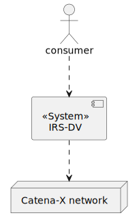
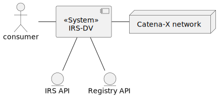
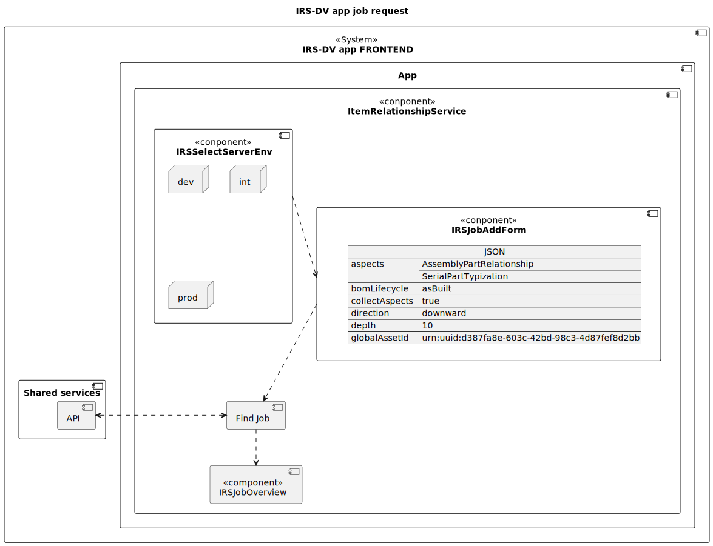
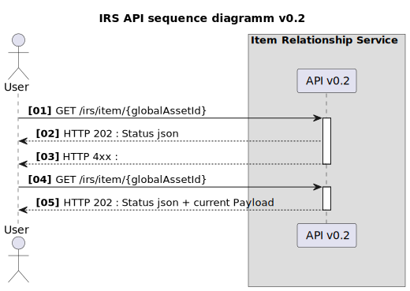
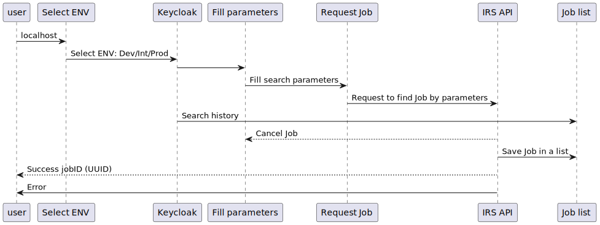

# Architecture documentation (arc42)

    // TODO: Table of contents need to be done. Please mark [X] in front of topic when its done. After every topic is done, we can remove "checkbox"

[ o ] - need overview <br>
[ x ] - done

## Table of Contents

- [ o ] [Introduction and goals](#introduction-and-goals)
  - [ o ] [Requirements overview](#requirements-overview)
  - [ o ] [Quality goals](#quality-goals)
  - [ o ] [Stakeholders](#stakeholders)
- [ o ] [Architecture constraints](#architecture-constraints)
  - [ o ] [Technical Constraints](#technical-constraints)
  - [ o ] [Organizational Constraints](#organizational-constraints)
  - [ o ] [Political constraints](#political-constraints)
  - [ o ] [Development conventions](#development-conventions)
- [ o ] [System scope and context](#system-scope-and-context)
  - [ o ] [Business context](#business-context)
  - [ o ] [Technical context](#technical-context)
- [ o ] [Solution strategy](#solution-strategy)
  - [ o ] [Introduction](#introduction)
  - [ o ] [Technology](#technology)
  - [ o ] [Structure](#structure)
- [ o ] [Building block view](#building-block-view)
  - [ o ] [Whitebox overall system](#whitebox-overall-system)
  - [ o ] [Level 1](#level-1)
  - [ o ] [IRS API](#references)
- [ o ] [Runtime view](#runtime-view)
  - [ o ] [Overall](#overall)
  - [ o ] [Scenario 1: Find a job](#scenario-1-find-a-job)
- [ ] [Deployment view](#deployment-view) still unclear whole topic
  - [ ] [Local deployment](#local-deployment)
  - [ ] [View Levels](#view-levels)
- [ ] [Cross-cutting concepts](#cross-cutting-concepts)
  - [ ] [Domain concepts](#domain-concepts)
  - [ ] [Safety and security concepts](#safety-and-security-concepts)
  - [ ] [Architecture and design patterns](#architecture-and-design-patterns)
  - [ ] ["Under-the-hood" concepts](#under-the-hood-concepts)
  - [ ] [Development concepts](#development-concepts)
  - [ ] [Operational concepts](#operational-concepts)
- [ ] [Quality requirements](#quality-requirements)
  - [ ] [List of requirements](#list-of-requirements)
- [ ] [Glossary](#glossary)
      <br> <br>

---

---

# Introduction and goals

This chapter gives you an overview about the goals of the service, in which context the service runs and which stakeholders are involved.

## Requirements overview

### What is the Item Relationship Service Debugging View?

The IRS-DV is a:

- Functional federated component
- Uses API endpoint to retrieve the tree structures in a recursive way, which data assets are distributed throughout the Catena-X network
- Reference implementation
- Catch and find errors

### Substantial Features

- provide a top-down BoM asBuilt tree structure along the submodel "AssemblyPartRelationship"
- usage of EDC consumer for communicating with the Catena-X network
- functionality of IRS provider will be handled by providers submodel servers
- federated IRS service
- 'asBuild' BoM of serialized components

## Quality goals

The following table entries define overall IRS-DV quality goals. The order of the topics do not resolve in a priority of the quality goals.

| Quality goal                  | Motivation and description                                                                                                                                                                                        |
| ----------------------------- | ----------------------------------------------------------------------------------------------------------------------------------------------------------------------------------------------------------------- |
| running reference application | The IRS-DV is built to traverse a distributed data chain across the automotive Industry. The IRS-DV release scope aims to build a running solution to find errors in the whole chain by a given request.          |
| multiple async job            | The IRS-DV is built to access multiple endpoints parallel. Since the for the Endpoint it is not clear yet how long a request will take to respond. The Service is built to handle multiple asynchronous requests. |
| cloud agnostic solution       | The IRS-DV is built as reference architecture and able to run on different cloud solutions. It uses helm charts, terraform and a abstracts the storage, so that it can easily be integrated on different systems. |
| base security measures        | The IRS-DV is built with a base set of security features. The program can only be used by logging in via Keyclock                                                                                                 |
| application reliability       | The IRS-DV architecture is set up so that the costumers can rely on reliable data chains                                                                                                                          |

## Stakeholders

| Role/name     | Contact                                                  | Expectations                                              |
| ------------- | -------------------------------------------------------- | --------------------------------------------------------- |
| Product Owner | Zahn Johannes johannes.zahn@bmw.de                       |                                                           |
| Back-end team |                                                          |                                                           |
| Developers    | Neal Buerger <br> Stephan Bauer <br> Giedrius Pacevicius | accept responsibility for architectural tasks in the team |

<br>
<br>

[Back to top](#)

<br>
<br>

# Architecture constraints

## Technical Constraints

| Name                                                                                                          | Description                                                                                                                                                                                                                                            |
| ------------------------------------------------------------------------------------------------------------- | ------------------------------------------------------------------------------------------------------------------------------------------------------------------------------------------------------------------------------------------------------ |
| Cloud Agnostic Architecture approach                                                                          | IRS provides a reference application/implementation which is deployable on any cloud ecosystem. There is no vendor lock to any cloud vendor.                                                                                                           |
| Kubernetes is used for Container Orchestration                                                                | Kubernetes as container orchestration system used for software deployment, scaling and management of the IRS application. This supports our software infrastructure and ensures efficient management and scalability of the IRS reference application. |
| Docker Container are used to provide a microservice oriented architecture                                     | Deployment made on reliable production ready images. Avoiding repetitive, mundane configuration tasks for container orchestration.                                                                                                                     |
| Docker Compose is used to define and tune multi container application based on docker container technologies. | Docker container to develop independently of the underlying OS.                                                                                                                                                                                        |

## Organizational Constraints

| Name           | Description                                                               | Comment                          |
| -------------- | ------------------------------------------------------------------------- | -------------------------------- |
| API Connection | IRS Application has to be accessible for the user in the App Marketplace. | App Marketplace & API Connection |

## Political constraints

| Name               | Description                                                                                                                                                                                   |
| ------------------ | --------------------------------------------------------------------------------------------------------------------------------------------------------------------------------------------- |
| Open Source        | FOSS licenses approved by the eclipse foundation has to be used. It could represent the initial set that the CX community agrees on to regulate the content contribution under FOSS licenses. |
| Apache License 2.0 | Apache License 2.0 is one of the approved licenses which should be used to respect and guarantee Intellectual property (IP).                                                                  |
| NodeJs             | Node.js is an open-source, cross-platform JavaScript runtime environment and library for running web applications outside the client's browser                                                |

## Development conventions

| Name                                     | Description                                                                                                                                                                                                                                           |
| ---------------------------------------- | ----------------------------------------------------------------------------------------------------------------------------------------------------------------------------------------------------------------------------------------------------- |
| Architecture documentation               | Architectural documentation of IRS-DV according to ARC42 template.                                                                                                                                                                                    |
| Coding guidelines                        | ESlint recomended TypeScript format.                                                                                                                                                                                                                  |
| Module structure                         | React single page application.                                                                                                                                                                                                                        |
| Code Analysis, Linting and Code Coverage | Consistent style increases readability and maintainability of the code base. Hence, we use analyzers to enforce consistency and style rules. We enforce the code style and rules in the CI to avoid merging code that does not comply with standards. |

## Code analysis, linting and code coverage

| Tool       | Scope                                                                                         | Rule                                                          | Configuration (via files / annotations) |
| ---------- | --------------------------------------------------------------------------------------------- | ------------------------------------------------------------- | --------------------------------------- |
| JEST       | Test coverage                                                                                 | Fail build on coverage < 80%                                  | .github\jest.config.js                  |
| Dependabot | Automated dependency updates built into GitHub. Provided pull requests on dependency updates. | Any dependency update generates a pull request automatically. | .github/dependabot.yml                  |
| Prettier   | Code formatter                                                                                | Code style for all developers are the same                    | .github/.prettierrc.json                |
| ESLINT     | Find and fix problems                                                                         | Find and fix problems with JavaScript code                    | .github/.eslintrc                       |

<br>
<br>

[Back to top](#)

<br>
<br>

# System scope and context

The IRS-DV acts as a middleware between consumers and manufacturers. This section describes the environment of IRS-DV. Who are its users, and with which other systems does it interact with.

## Business context



### Consumer

The consumer is end user who is searching and looking for a errors in all data chain of the Catena-X network. He need to get valid credentials issued by the Catena-X IAM.

### Catena-X network

The IRS-DV retrieves data from the Catena-X network (using the necessary infrastructure, see Technical Context), aggregates it and provides it back to the consumers. This connection is mandatory. If the Catena-X services are unavailable, the IRS-DV cannot perform any work.

## Technical context



## Component overview

### IRS-API

We use a REST API that is made by IRS team and can be used by any system registered in the Catena-X Keycloak. For communication we use HTTP(S) protocol.

### IRS-DV system

The IRS-DV system is created to search and show all related components of searched element by globalAssetId and other parameters.
<br>
<br>

[Back to top](#)

<br>
<br>

# Solution strategy

## Introduction

| Quality goal                  | Matching approaches in the solution                                                                                                                                                                       |
| ----------------------------- | --------------------------------------------------------------------------------------------------------------------------------------------------------------------------------------------------------- |
| application reliability       | <ul><li>only data source is the Catena-X network, data is fetched from IRS API</li><li>IRS-DV can be hosted decentralized by every participant by being an open source reference implementation</li></ul> |
| base security measures        | <ul><li>automatic static and dynamic code analysis tools as part of the pipeline</li></ul>                                                                                                                |
| cloud agnostic solution       | <ul><li>IRS-DV is provided as a Docker image</li><li>Helm charts assist in deploying the application in any Kubernetes environment</li></ul>                                                              |
| running reference application | <ul><li>Working application can be used as reference by anyone due to open source publishing </li></ul>                                                                                                   |

## Technology

The IRS-DV is developed using React framework. This choice was made due to the technical knowledge of the team and the widespread support of the framework.

Hosting the application is done using Docker and Kubernetes, which is widely used and vendor-independent regarding the hosting provider (e.g. AWS, Google Cloud, Azure, …​).

Communication is done using HTTP. This is the standard method in the Catena-X landscape and makes the IRS API easy to use.

## Structure

The IRS-DV consists of 3 main views:

1. the REST API to view/find Jobs (services component)
2. the job list
3. the visualization and tumbstones blocks

We search by parameters in REST API, and collecting fetched data in job list.

The job list is the place where IRS-DV is storing all fetched jobs and hold search history.

The visualization show us/consumer how elements are connected each other, and tumbstones show in what level data is missing.

<br>
<br>

[Back to top](#)

<br>
<br>

# Building block view

## Whitebox overall system

The interfaces show how the components interact with each other and which interfaces the IRS-DV are.

Full backend services graph you can find at **[IRS team](https://catenax-ng.github.io/tx-item-relationship-service/docs/arc42/full.html#_whitebox_overall_system)**.

### Component diagram


### Component description

| Components          | Description                                                                                      |
| ------------------- | ------------------------------------------------------------------------------------------------ |
| IRSSelectServerEnv  | Select server environmental between given servers                                                |
| IRSJobAddForm       | In this component, you can select settings according to which globalAssetId you are looking for. |
| IRSJobOverview      | IRS-DV history by search parameters                                                              |
| IRSJobVisualization | IRS-DV visualization based on search parameters. We show all related nodes.                      |
| IRSJobTombstones    | IRS-DV cached errors                                                                             |
| IRSJobStore         | Show all grid for filtered history                                                               |
| ErrorPage           | Catch errors(router error and ... ) and show error page                                          |

## Level 1

### Component diagram



### Component description

| Components         | Description                                                                                                                                              |
| ------------------ | -------------------------------------------------------------------------------------------------------------------------------------------------------- |
| IRSSelectServerEnv | The IRS-DV you can select between environments you want to find job                                                                                      |
| IRSJobAddForm      | The IRSJobAddForm is a JSON format with parameters, you can add "aspects", "direction", "globalAssetId" and other parameters. (see full json file below) |
| IRSJobOverview     | The IRSJobOverview is a component which manages (start, cancel, auto refresh) the jobs, and store them in a table list.                                  |

```json
json example:
{
"aspects": [
"AssemblyPartRelationship",
"SerialPartTypization"
],
"bomLifecycle": "asBuilt",
"collectAspects": true,
"direction": "downward",
"depth": 10,
"globalAssetId": "urn:uuid:d387fa8e-603c-42bd-98c3-4d87fef8d2bb"
}


```

## IRS API

### References

The Swagger documentation can be found in the local deployment of the reference application. More information can be found in the GitHub repository: https://github.com/eclipse-tractusx/item-relationship-service/blob/main/README.md

### IRS interaction diagram



<br>
<br>

[Back to top](#)

<br>
<br>

# Runtime view

This section covers the main processes of the IRS-DV.

## Overall

This section describes the overall flow of the IRS-DV.



## Scenario 1: Find a job

This section describes what happens when user search for a job.

create job (IAMGE)

### Overview

User run application locally and select environment. After user select environment and login thought Keycloak user can fill parameters to section and search for a job. If job is found, user will saw it in "Job list". If user cancel Job search it will shows in a "Job list". After Job search is completed user will see it in a "Job list" as "COMPLETED" and can open to overview the job.


<br>
<br>

[Back to top](#)

<br>
<br>

# Deployment view

The deployment view shows the IRS-DV application 

```
Need later overview
```


**ArgoCD**

Argo CD is a declarative, GitOps continuous delivery tool for Kubernetes. See https://argo-cd.readthedocs.io/.

**Vault**

HashiCorp Vault stores credentials, which are picked up by ArgoCD to deploy them to the application.

Every secret information needed at runtime must be stored here and must never be part of the IRS Helm charts

**GitHub**

GitHub contains the application source code as well as the Helm charts used for deployment. The IRS Helm charts can be found here: https://github.com/eclipse-tractusx/item-relationship-service/tree/main/charts


## Local deployment

For information on how to run the application locally, please check the README documentation in GitHub: https://github.com/eclipse-tractusx/item-relationship-service/blob/main/README.md

## View Levels

## Level 0 - Cluster overview

### Isolated environment

The isolated environment contains the IRS as well as the surrounding services, excluding the external IAM.

isolated (IMAGE)

### Integrated environment

The integrated environment contains the IRS and is integrated with the rest of the Catena-X network.

integrated (IMAGE)

## Level 1 - IRS application

This section focuses only on the IRS itself, detached from its neighbors. It shows the resources deployed in Kubernetes for the IRS.

irs resources (IMAGE)
**Pod**

This is the actual IRS Docker image which runs as a container. The ports are only available internally and can be opened up with the Service.

**Secrets**

The secret information (e.g. connection credentials) is stored here and provided to the Pod at runtime.

**Service**

The service resource opens up selected ports of the Pod so that other applications in the same cluster can access it or to be used by the Ingress.

**Ingress**

The ingress uses a reverse proxy to provide specified Service ports to the internet under a specified URL. This make the IRS API publicly available.
<br>
<br>

[Back to top](#)

<br>
<br>

# Cross-cutting concepts

## Domain concepts

### Domain entity model

domain entity model (IMAGE)

### Domain model

domain model (IMAGE)


### JobStatus

A job can be in one of the following states:

| State     | Description                                                                     |
| --------- | ------------------------------------------------------------------------------- |
| INITIAL   | The job was stored by the system and is now queued for processing.              |
| RUNNING   | The job is currently being processed.                                           |
| COMPLETED | The job has completed. See the job response for details on the data.            |
| CANCELED  | The job could not be processed, user canceled request                           |
| ERROR     | The job could not be processed correctly by the IRS due to a technical problem. |

job state machine (IMAGE)

### Job Store Datamodel

inmemory model (IMAGE)

### Job Response Datamodel

job response model (IMAGE)

## Safety and security concepts

### Authentication / Authorization

### IRS API

The IRS is secured using OAuth2.0 / Open ID Connect. Every request to the IRS API requires a valid bearer token.

No special roles are required. Every user that can log in to the authentication provider may use the IRS API.

### IRS as DTR client

The IRS acts as a client for the Digital Twin Registry (DTR), which is also secured using OAuth2.0 / Open ID Connect. The IRS uses client credentials to authenticate requests to the DTR. Due to this, the IRS account needs to have access to every item in the DTR, unrelated to the permissions of the account calling the IRS API.

### IRS as EDC client

The IRS accesses the Catena-X network via the EDC consumer connector. This component requires authentication via a DAPS certificate, which was provided to the IRS via the network authority.

The DAPS certificate identifies the IRS and is used to acquire access permissions for the data transferred via EDC.

## Credentials

Credentials must never be stored in Git!

## Architecture and design patterns

### Dependency inversion

For the IRS, we utilize the dependency inversion mechanisms provided by Spring Boot as much as possible.

The principle says:

High-level modules should not import anything from low-level modules. Both should depend on abstractions (e.g., interfaces). Abstractions should not depend on details. Details (concrete implementations) should depend on abstractions.

Adhering to this, we define clear interfaces between the different domains (e.g. job orchestration and AAS communication) in the IRS and let dependencies be injected by the framework. This improves testability of the classes as well.

### Hexagonal architecture

The hexagonal architecture divides a system into several loosely-coupled interchangeable components, such as the application core, the database, the user interface, test scripts and interfaces with other systems. This approach is an alternative to the traditional layered architecture.

For the IRS, this means decoupling the application logic from components like the BLOB store, the REST API controllers or the AAS client connection. With an interface between the parts (so-called port), it is easy to switch to other implementations, e.g. if you want to change the persistence implementation. No changes to the application logic will be necessary.

architecture (IMAGE)

## "Under-the-hood" concepts

### Persistency

The IRS stores two types of data in a persistent way:

- Job metadata
- Job payloads, e.g. AAS shells or submodel data

All of this is data is stored in an object store. The currently used implementation is Minio (Amazon S3 compatible). This reduces the complexity in storing and retrieving data. There also is no predefined model for the data, every document can be stored as it is. The downside of this approach is lack of query functionality, as we can only search through the keys of the entries but not based on the value data. In the future, another approach or an additional way to to index the data might be required.

To let the data survive system restarts, Minio needs to use a persistent volume for the data storage. A default configuration for this is provided in the Helm charts.

### Transaction handling

There currently is no transaction management in the IRS.

### Session handling

There is no session handling in the IRS, access is solely based on bearer tokens, the API is stateless.

### Communication and integration

All interfaces to other systems are using RESTful calls over HTTP(S). Where central authentication is required, a common Keycloak instance is used.

For outgoing calls, the Spring RestTemplate mechanism is used and separate RestTemplates are created for the different ways of authentication.

For incoming calls, we utilize the Spring REST Controller mechanism, annotating the interfaces accordingly and also documenting the endpoints using OpenAPI annotations.

### Exception and error handling

There are two types of potential errors in the IRS:

### Technical errors

Technical errors occur when there is a problem with the application itself, its configuration or directly connected infrastructure, e.g. the Minio persistence. Usually, the application cannot solve these problems by itself and requires some external support (manual work or automated recovery mechanisms, e.g. Kubernetes liveness probes).

These errors are printed mainly to the application log and are relevant for the healthchecks.

### Functional errors

Functional errors occur when there is a problem with the data that is being processed or external systems are unavailable and data cannot be sent / fetched as required for the process. While the system might not be able to provide the required function at that moment, it may work with a different dataset or as soon as the external systems recover.

These errors are reported in the Job response and do not directly affect application health.

### Rules for exception handling

_Throw or log, don’t do both_

When catching an exception, either log the exception and handle the problem or rethrow it, so it can be handled at a higher level of the code. By doing both, an exception might be written to the log multiple times, which can be confusing.

_Write own base exceptions for (internal) interfaces_
By defining a common (checked) base exception for an interface, the caller is forced to handle potential errors, but can keep the logic simple. On the other hand, you still have the possibility to derive various, meaningful exceptions for different error cases, which can then be thrown via the API.

Of course, when using only RuntimeExceptions, this is not necessary - but those can be overlooked quite easily, so be careful there.

_Central fallback exception handler_
There will always be some exception that cannot be handled inside of the code correctly - or it may just have been unforeseen. A central fallback exception handler is required so all problems are visible in the log and the API always returns meaningful responses. In some cases, this is as simple as a HTTP 500.

Dont expose too much exception details over API
It’s good to inform the user, why their request did not work, but only if they can do something about it (HTTP 4xx). So in case of application problems, you should not expose details of the problem to the caller. This way, we avoid opening potential attack vectors.

### Parallelization and threading

The heart of the IRS is the parallel execution of planned jobs. As almost each job requires multiple calls to various endpoints, those are done in parallel as well to reduce the total execution time for each job.

Tasks execution is orchestrated by the JobOrchestrator class. It utilizes a cental ExecutorService, which manages the number of threads and schedules new Task as they come in.

### Plausibility checks and validation

Data validation happens at two points:

- IRS API: the data sent by the client is validated to match the model defined in the IRS. If the validation fails, the IRS sends a HTTP 400 response and indicates the problem to the caller.
- Submodel payload: each time a submodel payload is requested from via EDC, the data is validated against the model defined in the SemanticHub for the matching aspect type.

## Development concepts

### Build, test, deploy

The IRS is built using Maven and utilizes all the standard concepts of it. Test execution is part of the build process and a minimum test coverage of 80% is enforced.

The project setup contains a multi-module Maven build. Commonly used classes (like the IRS data model) should be extracted into a separate submodule and reused across the project. However, this is not a "one-size-fits-all" solution. New submodules should be created with care and require a review by the team.

The Maven build alone only leads up to the JAR artifact of the IRS. Do create Docker images, the Docker build feature is used. This copies all resources into a builder image, builds the software and creates a final Docker image at the end that can then be deployed.

Although the Docker image can be deployed in various ways, the standard solution are the provided Helm charts, which describe the required components as well.

### Code generation

There are two methods of code generation in the IRS:

### Lombok

The Lombok library is heavily used to generate boilerplate code (like Constructors, Getters, Setters, Builders…​). This way, code can be written faster and this boilerplate code is excluded from test coverage, which keeps the test base lean.

### Swagger / OpenAPI

The API uses OpenAPI annotations to describe the endpoints with all necessary information. The annotations are then used to automatically generate the OpenAPI specification file, which can be viewed in the Swagger UI that is deployed with the application.

The generated OpenAPI specification file is automatically compared to a fixed, stored version of it to avoid unwanted changes of the API.

### Migration

There currently is no data migration mechanism for the IRS. In case the model of the persisted data (Jobs) changes, data is dropped and Jobs will need to be recreated.

### Configurability

The IRS utilizes the configuration mechanism provided by Spring Boot. Configuration properties can be defined in the file src/main/resources/application.yml

For local testing purposes, there is an additional configuration file called application-local.yml. Values can be overriden there to support the local dev environment.

Other profiles should be avoided. Instead, any value that might need to change in a runtime environment must be overridable using environment variables. The operator must have total control over the configuration of the IRS.

## Operational concepts

### Administration

<br>

### Configuration

The IRS can be configured using two mechanisms:

### application.yml

If you build the IRS yourself, you can modify the application.yml config that is shipped with the IRS. This file contains all possible config entries for the application. Once the Docker image has been built, these values can only be overwritten using the Spring external config mechanism (see https://docs.spring.io/spring-boot/docs/2.1.9.RELEASE/reference/html/boot-features-external-config.html), e.g. by mounting a config file in the right path or using environment variables.

### Helm Chart

The most relevant config properties are exposed as environment variables and must be set in the Helm chart so the application can run at all. Check the IRS Helm chart in Git for all available variables.

## Disaster-Recovery

### Ephemeral components

All components in the IRS deployment not listed in the persistent components section below are considered ephemeral and are easily replaced in a disaster scenario. All deployment components are described using Helm charts, which can be used to restore the deployment with the Docker images. Should the Docker images go missing, they can be restored by executing the build pipelines for the corresponding version tag of the component.

### Persistent components

These components utilize data persistence, which needs to be backed up separately by the operator.

- Minio persistent volume: Contains the stored Job information. In case of data loss, Jobs can be started again to retrieve the data from the network.

- Prometheus persistent volume: Contains the monitoring data of the IRS. In case of data loss, no analysis can be done for past timeframes.

- Vault secrets: In case of data loss, the credentials stored in the Vault need to be recreated manually. See the deployment view for an overview.

### Scaling

If the number of consumers raises, the IRS can be scaled up by using more resources for the Deployment Pod. Those resources can be used to utilize more parallel threads to handle Job execution.

### Clustering

The IRS can run in clustered mode, as each running job is only present in one pod at a time. Note: as soon as a resume feature is implemented, this needs to be addressed here.

### Logging

Logs are being written directly to stdout and are picked up by the cluster management.

### Monitoring

The application can be monitored using Prometheus and Grafana. Both systems are defined in the Helm charts with a default setup. A number of Grafana dashboards are deployed automatically, to display data about:

- Pod / JVM resources

- API metrics

- Functional information about IRS Jobs
  <br>
  <br>

[Back to top](#)

<br>
<br>

# Quality requirements

The quality scenarios in this section depict the fundamental quality goals as well as other required quality properties. They allow the evaluation of decision alternatives.

- Quality attribute: A characteristic of software, or a generic term applying to quality factors, quality subfactors, or metric values.

- Quality factor: A management-oriented attribute of software that contributes to its quality.

- Quality subfactor: A decomposition of a quality factor or quality subfactor to its technical components.

- Metric value: A metric output or an element that is from the range of a metric.

- Software quality metric: A function whose inputs are software data and whose output is a single numerical value that can be interpreted as the degree to which software possesses a given attribute that affects its quality.

**Source**: IEEE standard 1061 “Standard for a Software Quality Metrics Methodology”

## List of requirements

This section will be filled soon.
<br>
<br>

[Back to top](#)

<br>
<br>

# Glossary

| Term                                | Description                                                                                                                                                                                                                                                                          |
| ----------------------------------- | ------------------------------------------------------------------------------------------------------------------------------------------------------------------------------------------------------------------------------------------------------------------------------------ |
| AAS                                 | Asset Administration Shell (Industry 4.0)                                                                                                                                                                                                                                            |
| Aspect servers (submodel endpoints) | Companies participating in the interorganizational data exchange provides their data over aspect servers. The so called "submodel-descriptors" in the AAS shells are pointing to these AspectServers which provide the data-assets of the participating these companies in Catena-X. |
| BoM                                 | Bill of Materials                                                                                                                                                                                                                                                                    |
| Edge                                | see Traversal Aspect                                                                                                                                                                                                                                                                 |
| IRS                                 | Item Relationship Service                                                                                                                                                                                                                                                            |
| IRS-DV                              | Item Relationship service Debugging view                                                                                                                                                                                                                                             |
| Item Graph                          | The result returned via the IRS. This corresponds to a tree structure in which each node represents a part of a virtual asset.                                                                                                                                                       |
| MTPDC                               | Formerly known Service Name: Multi Tier Parts Data Chain                                                                                                                                                                                                                             |
| PRS                                 | Formerly known Service Name: Parts Relationship Name                                                                                                                                                                                                                                 |
| Traversal Aspect                    | aka Edge: Aspect which the IRS uses for traversal through the data chain. Identified by a parent-child or a child-parent relationship.<br><br>Samples: SingleLevelBomAsPlanned, AssemblyPartRelationship and SingleLevelUsageAsBuilt                                                 |

<br>
<br>

[Back to top](#)

<br>
<br>
```
