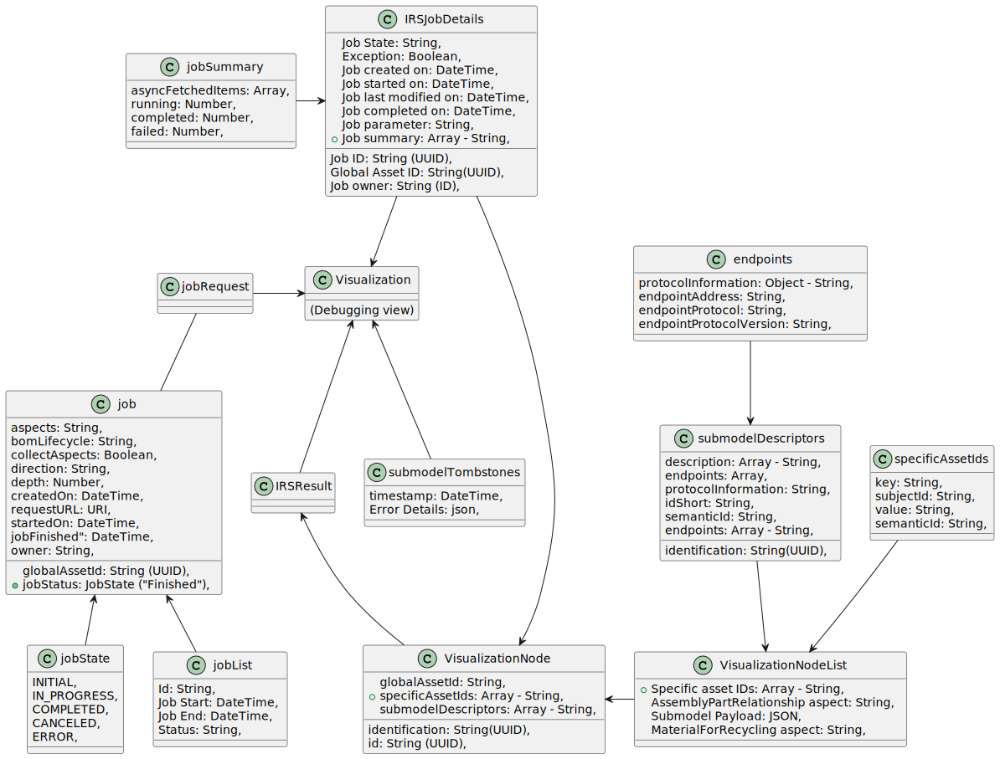
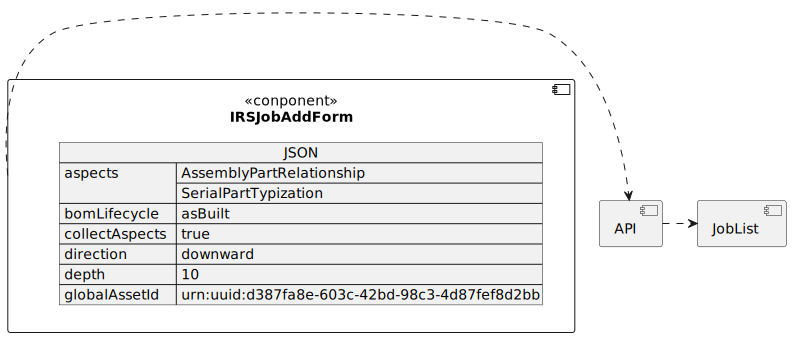

# Architecture documentation (arc42)

    // TODO: Table of contents need to be done. Please mark [X] in front of topic when its done. After every topic is done, we can remove "checkbox"

[ o ] - need overview <br>
[ x ] - done

## Table of Contents

- [ x ] [Introduction and goals](#introduction-and-goals)
  - [ x ] [Requirements overview](#requirements-overview)
  - [ x ] [Quality goals](#quality-goals)
  - [ x ] [Stakeholders](#stakeholders)
- [ o ] [Architecture constraints](#architecture-constraints)
  - [ o ] [Technical Constraints](#technical-constraints)
  - [ o ] [Organizational Constraints](#organizational-constraints)
  - [ o ] [Political constraints](#political-constraints)
  - [ o ] [Development conventions](#development-conventions)
- [ o ] [System scope and context](#system-scope-and-context)
  - [ o ] [Business context](#business-context)
  - [ o ] [Technical context](#technical-context)
- [ o ] [Solution strategy](#solution-strategy)
  - [ o ] [Introduction](#introduction)
  - [ o ] [Technology](#technology)
  - [ o ] [Structure](#structure)
- [ o ] [Building block view](#building-block-view)
  - [ o ] [Whitebox overall system](#whitebox-overall-system)
  - [ o ] [Level 1](#level-1)
  - [ o ] [IRS API](#references)
- [ o ] [Runtime view](#runtime-view)
  - [ o ] [Overall](#overall)
  - [ o ] [Scenario 1: Find a job](#scenario-1-find-a-job)
- [ ] [Deployment view](#deployment-view) still unclear whole topic
  - [ ] [Local deployment](#local-deployment)
  - [ ] [View Levels](#view-levels)
- [ o ] [Cross-cutting concepts](#cross-cutting-concepts)
  - [ o ] [Domain concepts](#domain-concepts)
  - [ o ] [Safety and security concepts](#safety-and-security-concepts)
  - [ o ] ["Under-the-hood" concepts](#under-the-hood-concepts)
  - [ o ] [Development concepts](#development-concepts)
  - [ o ] [Operational concepts](#operational-concepts)
- [ o ] [Quality requirements](#quality-requirements)
  - [ o ] [List of requirements](#list-of-requirements)
- [ o ] [Glossary](#glossary)

<br>

---

---

# Introduction and goals

This chapter gives you an overview about the goals of the service, in which context the service runs and which stakeholders are involved.

## Requirements overview

### What is the Item Relationship Service Debugging View?

The IRS-DV is a:

- Web-frontend to visualize an IRS Job to detect errors and failures in the job
- Uses API endpoint to retrieve the tree structures in a recursive way, which data assets are distributed throughout the Catena-X network
- Reference implementation

### Substantial Features

- provide a top-down BoM asBuilt tree structure along the submodel "AssemblyPartRelationship"
- usage of IRS Jobs endpoint for communicating with the Catena-X network

## Quality goals

The following table entries define overall IRS-DV quality goals. The order of the topics do not resolve in a priority of the quality goals.

| Quality goal                  | Motivation and description                                                                                                                                                                                        |
| ----------------------------- | ----------------------------------------------------------------------------------------------------------------------------------------------------------------------------------------------------------------- |
| running reference application | The IRS-DV is built to visualize completed IRS-Jobs. The IRS-DV release scope aims to build a running solution to display a job as a tree of nodes, with an highlight on failing nodes.                           |
| cloud agnostic solution       | The IRS-DV is built as reference architecture and able to run on different cloud solutions. It uses helm charts, terraform and a abstracts the storage, so that it can easily be integrated on different systems. |
| base security measures        | The IRS-DV is built with a base set of security features. The program can only be used by logging in via Keyclock                                                                                                 |
| application reliability       | The IRS-DV architecture is set up so that the costumers can rely on reliable data chains                                                                                                                          |

<br>
<br>

[Back to top](#)

<br>
<br>

# Architecture constraints

## Technical Constraints

| Name                                                                                                          | Description                                                                                                                                                                                                                                            |
| ------------------------------------------------------------------------------------------------------------- | ------------------------------------------------------------------------------------------------------------------------------------------------------------------------------------------------------------------------------------------------------ |
| Cloud Agnostic Architecture approach                                                                          | IRS provides a reference application/implementation which is deployable on any cloud ecosystem. There is no vendor lock to any cloud vendor.                                                                                                           |
| Kubernetes is used for Container Orchestration                                                                | Kubernetes as container orchestration system used for software deployment, scaling and management of the IRS application. This supports our software infrastructure and ensures efficient management and scalability of the IRS reference application. |
| Docker Container are used to provide a microservice oriented architecture                                     | Deployment made on reliable production ready images. Avoiding repetitive, mundane configuration tasks for container orchestration.                                                                                                                     |
| Docker Compose is used to define and tune multi container application based on docker container technologies. | Docker container to develop independently of the underlying OS.                                                                                                                                                                                        |
|                                                                                                               |

## Organizational Constraints

| Name             | Description                                              | Comment                                           |
| ---------------- | -------------------------------------------------------- | ------------------------------------------------- |
| IRS Jobs Service | Provide IRS as a C-X Shared Data Service.                | Multiple target IRS Job services are configurable |
| Keycloak         | Authentication has to be handled by a keycloak instance. |                                                   |

## Political constraints

| Name               | Description                                                                                                                                                                                   |
| ------------------ | --------------------------------------------------------------------------------------------------------------------------------------------------------------------------------------------- |
| Open Source        | FOSS licenses approved by the eclipse foundation has to be used. It could represent the initial set that the CX community agrees on to regulate the content contribution under FOSS licenses. |
| Apache License 2.0 | Apache License 2.0 is one of the approved licenses which should be used to respect and guarantee Intellectual property (IP).                                                                  |
| NodeJs             | Node.js is an open-source, cross-platform JavaScript runtime environment and library for running web applications outside the client's browser                                                |

## Development conventions

| Name                                     | Description                                                                                                                                                                                                                                           |
| ---------------------------------------- | ----------------------------------------------------------------------------------------------------------------------------------------------------------------------------------------------------------------------------------------------------- |
| Architecture documentation               | Architectural documentation of IRS-DV according to ARC42 template.                                                                                                                                                                                    |
| Coding guidelines                        | ESlint recommended TypeScript format.                                                                                                                                                                                                                 |
| Module structure                         | React single page application.                                                                                                                                                                                                                        |
| Code Analysis, Linting and Code Coverage | Consistent style increases readability and maintainability of the code base. Hence, we use analyzers to enforce consistency and style rules. We enforce the code style and rules in the CI to avoid merging code that does not comply with standards. |

## Code analysis, linting and code coverage

| Tool       | Scope                                                                                         | Rule                                                          | Configuration (via files / annotations)  |
| ---------- | --------------------------------------------------------------------------------------------- | ------------------------------------------------------------- | ---------------------------------------- |
| Vitest     | Test coverage                                                                                 | Fail build on coverage < 80%                                  | vite.config.ts                           |
| Dependabot | Automated dependency updates built into GitHub. Provided pull requests on dependency updates. | Any dependency update generates a pull request automatically. | .github/dependabot.yml                   |
| Prettier   | Code formatter                                                                                | Code style for all developers are the same                    | .prettierrc.json                         |
| ESLINT     | Find and fix problems                                                                         | Find and fix problems with JavaScript code                    | .github/.eslintrc                        |
| SonaCloud  | CodeSmell and Security Scan                                                                   | Global catena-x configuration.                                |
| Veracode   | Packages and Security Scan                                                                    | Global catena-x configuration.                                | https://web.analysiscenter.veracode.com/ |

<br>
<br>

[Back to top](#)

<br>
<br>

# System scope and context

The IRS-DV acts as a middleware between consumers and manufacturers. This section describes the environment of IRS-DV. Who are its users, and with which other systems does it interact with.

## Business context


### Consumer

The consumer is end user who is searching and looking for a errors in all data chain of the Catena-X network. He need to get valid credentials issued by the Catena-X IAM.

### Catena-X network

The IRS-DV retrieves data from the Catena-X network (using the necessary infrastructure, see Technical Context), aggregates it and provides it back to the consumers. This connection is mandatory. If the Catena-X services are unavailable, the IRS-DV cannot perform any work.

## Technical context


## Component overview

### IRS-API

We use a REST API that is made by IRS team and can be used by any system registered in the Catena-X Keycloak. For communication we use HTTP(S) protocol.

### IRS-DV system

The IRS-DV system is created to search and show all related components of searched element by globalAssetId and other parameters.
<br>
<br>

[Back to top](#)

<br>
<br>

# Solution strategy

## Introduction

| Quality goal                  | Matching approaches in the solution                                                                                                                                                                       |
| ----------------------------- | --------------------------------------------------------------------------------------------------------------------------------------------------------------------------------------------------------- |
| application reliability       | <ul><li>only data source is the Catena-X network, data is fetched from IRS API</li><li>IRS-DV can be hosted decentralized by every participant by being an open source reference implementation</li></ul> |
| base security measures        | <ul><li>automatic static and dynamic code analysis tools as part of the pipeline</li></ul>                                                                                                                |
| cloud agnostic solution       | <ul><li>IRS-DV is provided as a Docker image</li><li>Helm charts assist in deploying the application in any Kubernetes environment</li></ul>                                                              |
| running reference application | <ul><li>Working application can be used as reference by anyone due to open source publishing </li></ul>                                                                                                   |

## Technology

The IRS-DV is developed using React framework. This choice was made due to the technical knowledge of the team and the widespread support of the framework.

Hosting the application is done using Docker and Kubernetes, which is widely used and vendor-independent regarding the hosting provider (e.g. AWS, Google Cloud, Azure, …​).

Communication is done using HTTP. This is the standard method in the Catena-X landscape and makes the IRS API easy to use.

## Structure

The IRS-DV consists of 3 main views:

1. the IRS API to view/find Jobs (services component)
2. the job list
3. the visualization and tombstones blocks

IRS-DV search by parameters in IRS API, and collecting fetched data in job list.

The job list is the place where IRS-DV is storing all fetched jobs and hold search history.

The visualization show us/consumer how elements are connected each other, and tombstones show in what level data is missing.

<br>
<br>

[Back to top](#)

<br>
<br>

# Building block view

## Whitebox overall system

The interfaces show how the components interact with each other and which interfaces the IRS-DV are.

Full backend services graph you can find at **[IRS team](https://catenax-ng.github.io/tx-item-relationship-service/docs/arc42/full.html#_whitebox_overall_system)**.

### Component diagram


### Component description

| Components          | Description                                                                                      |
| ------------------- | ------------------------------------------------------------------------------------------------ |
| IRSSelectServerEnv  | Select server environmental between given servers                                                |
| IRSJobAddForm       | In this component, you can select settings according to which globalAssetId you are looking for. |
| IRSJobOverview      | IRS-DV history by search parameters                                                              |
| IRSJobVisualization | IRS-DV visualization based on search parameters. We show all related nodes.                      |
| IRSJobTombstones    | IRS-DV cached errors                                                                             |
| IRSJobStore         | Show all grid for filtered history                                                               |
| ErrorPage           | Catch errors(router error and ... ) and show error page                                          |

## Level 1

### Component diagram


### Component description

| Components         | Description                                                                                                                                              |
| ------------------ | -------------------------------------------------------------------------------------------------------------------------------------------------------- |
| IRSSelectServerEnv | The IRS-DV you can select between environments you want to find job                                                                                      |
| IRSJobAddForm      | The IRSJobAddForm is a JSON format with parameters, you can add "aspects", "direction", "globalAssetId" and other parameters. (see full json file below) |
| IRSJobOverview     | The IRSJobOverview is a component which manages (start, cancel, auto refresh) the jobs, and store them in a table list.                                  |

```json
json example:
{
"aspects": [
"AssemblyPartRelationship",
"SerialPartTypization"
],
"bomLifecycle": "asBuilt",
"collectAspects": true,
"direction": "downward",
"depth": 10,
"globalAssetId": "urn:uuid:d387fa8e-603c-42bd-98c3-4d87fef8d2bb"
}


```

## IRS API

### References

The Swagger documentation can be found in the local deployment of the reference application. More information can be found in the GitHub repository: https://github.com/eclipse-tractusx/item-relationship-service/blob/main/README.md

### IRS interaction diagram


<br>
<br>

[Back to top](#)

<br>
<br>

# Runtime view

This section covers the main processes of the IRS-DV.

## Overall

This section describes the overall flow of the IRS-DV.


## Scenario 1: Find a job

This section describes what happens when user search for a job.

create job (IAMGE)

### Overview

User run application locally and select environment. After user select environment and login thought Keycloak user can fill parameters to section and search for a job. If job is found, user will saw it in "Job list". If user cancel Job search it will shows in a "Job list". After Job search is completed user will see it in a "Job list" as "COMPLETED" and can open to overview the job.

<br>
<br>

[Back to top](#)

<br>
<br>

# Deployment view

The deployment view shows the IRS-DV application

```
Need later overview
```

**ArgoCD**

Argo CD is a declarative, GitOps continuous delivery tool for Kubernetes. See https://argo-cd.readthedocs.io/.

**Vault**

HashiCorp Vault stores credentials, which are picked up by ArgoCD to deploy them to the application.

Every secret information needed at runtime must be stored here and must never be part of the IRS Helm charts

**GitHub**

GitHub contains the application source code as well as the Helm charts used for deployment. The IRS Helm charts can be found here: https://github.com/eclipse-tractusx/item-relationship-service/tree/main/charts

## Local deployment

For information on how to run the application locally, please check the README documentation in GitHub: https://github.com/eclipse-tractusx/item-relationship-service/blob/main/README.md

## View Levels

## Level 0 - Cluster overview

### Isolated environment

The isolated environment contains the IRS as well as the surrounding services, excluding the external IAM.

isolated (IMAGE)

### Integrated environment

The integrated environment contains the IRS and is integrated with the rest of the Catena-X network.

integrated (IMAGE)

## Level 1 - IRS application

This section focuses only on the IRS itself, detached from its neighbors. It shows the resources deployed in Kubernetes for the IRS.

irs resources (IMAGE)
**Pod**

This is the actual IRS Docker image which runs as a container. The ports are only available internally and can be opened up with the Service.

**Secrets**

The secret information (e.g. connection credentials) is stored here and provided to the Pod at runtime.

**Service**

The service resource opens up selected ports of the Pod so that other applications in the same cluster can access it or to be used by the Ingress.

**Ingress**

The ingress uses a reverse proxy to provide specified Service ports to the internet under a specified URL. This make the IRS API publicly available.
<br>
<br>

[Back to top](#)

<br>
<br>

# Cross-cutting concepts

## Domain concepts

### Domain model



### JobStatus

A job can be in one of the following states:

| State     | Description                                                                     |
| --------- | ------------------------------------------------------------------------------- |
| INITIAL   | The job was stored by the system and is now queued for processing.              |
| RUNNING   | The job is currently being processed.                                           |
| COMPLETED | The job has completed. See the job response for details on the data.            |
| CANCELED  | The job could not be processed, user canceled request                           |
| ERROR     | The job could not be processed correctly by the IRS due to a technical problem. |

### Job Response Datamodel



## Safety and security concepts

### Authentication / Authorization

### IRS API

The IRS-DV accesses the Catena-X network via the EDC consumer connector (Keycloak).
System are using RESTful calls over HTTP(S). Where central authentication is required, a common Keycloak instance is used. We are only using "GET" protocol from API.

## Credentials

Credentials must never be stored in Git!

## "Under-the-hood" concepts

### Exception and error handling

There are two types of potential errors in the IRS:

### Technical errors

Technical errors occur when there is a problem with the API itself.

### Functional errors

Functional errors occur when there is a problem with the data that is being processed or external systems are unavailable and data cannot be sent / fetched as required for the process. While the system might not be able to provide the required function at that moment, it may work with a different dataset or as soon as the external systems recover.

## Development concepts

### Build, test, deploy

The IRS-DV is built using React and utilizes all the standard concepts of it. Test execution is part of the build process and a minimum test coverage of 80% is enforced.

```
TODO: Add info about Helm chart
```

Although the Docker image can be deployed in various ways, the standard solution are the provided Helm charts, which describe the required components as well.

## Operational concepts

### Configuration - Helm Chart

The most relevant config properties are exposed as environment variables and must be set in the Helm chart so the application can run at all. Check the IRS Helm chart in Git for all available variables.

  <br>
  <br>

[Back to top](#)

<br>
<br>

# Quality requirements

The quality scenarios in this section depict the fundamental quality goals as well as other required quality properties. They allow the evaluation of decision alternatives.

- Quality attribute: A characteristic of software, or a generic term applying to quality factors, quality subfactors, or metric values.

- Quality factor: A management-oriented attribute of software that contributes to its quality.

- Quality subfactor: A decomposition of a quality factor or quality subfactor to its technical components.

- Metric value: A metric output or an element that is from the range of a metric.

- Software quality metric: A function whose inputs are software data and whose output is a single numerical value that can be interpreted as the degree to which software possesses a given attribute that affects its quality.

**Source**: IEEE standard 1061 “Standard for a Software Quality Metrics Methodology”

## List of requirements

This section will be filled soon.
<br>
<br>

[Back to top](#)

<br>
<br>

# Glossary

| Term                                | Description                                                                                                                                                                                                                                                                          |
| ----------------------------------- | ------------------------------------------------------------------------------------------------------------------------------------------------------------------------------------------------------------------------------------------------------------------------------------ |
| AAS                                 | Asset Administration Shell (Industry 4.0)                                                                                                                                                                                                                                            |
| Aspect servers (submodel endpoints) | Companies participating in the interorganizational data exchange provides their data over aspect servers. The so called "submodel-descriptors" in the AAS shells are pointing to these AspectServers which provide the data-assets of the participating these companies in Catena-X. |
| BoM                                 | Bill of Materials                                                                                                                                                                                                                                                                    |
| Edge                                | see Traversal Aspect                                                                                                                                                                                                                                                                 |
| IRS                                 | Item Relationship Service                                                                                                                                                                                                                                                            |
| IRS-DV                              | Item Relationship service Debugging view                                                                                                                                                                                                                                             |
| Item Graph                          | The result returned via the IRS. This corresponds to a tree structure in which each node represents a part of a virtual asset.                                                                                                                                                       |
| MTPDC                               | Formerly known Service Name: Multi Tier Parts Data Chain                                                                                                                                                                                                                             |
| PRS                                 | Formerly known Service Name: Parts Relationship Name                                                                                                                                                                                                                                 |
| Traversal Aspect                    | aka Edge: Aspect which the IRS uses for traversal through the data chain. Identified by a parent-child or a child-parent relationship.<br><br>Samples: SingleLevelBomAsPlanned, AssemblyPartRelationship and SingleLevelUsageAsBuilt                                                 |

<br>
<br>

[Back to top](#)

<br>
<br>
