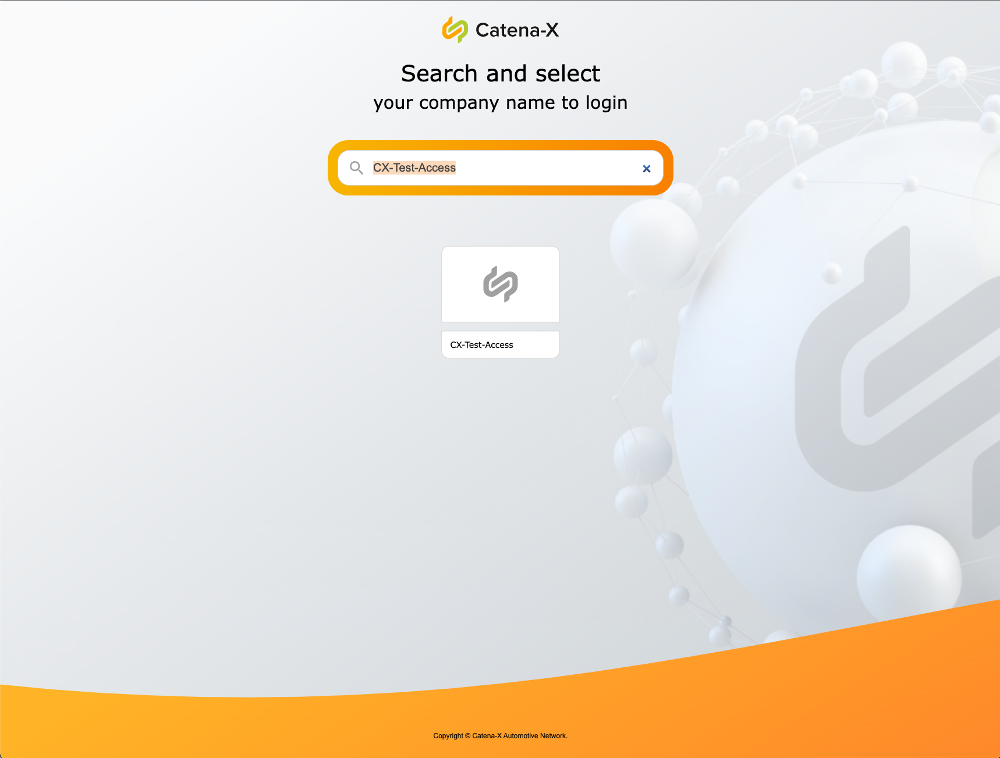
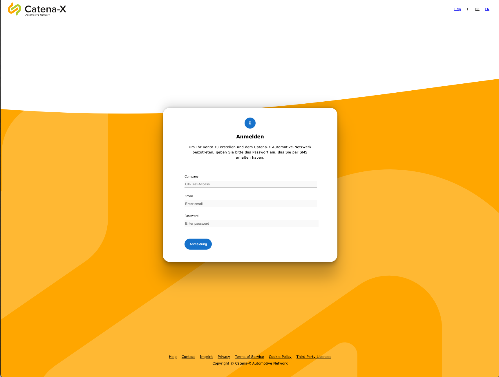
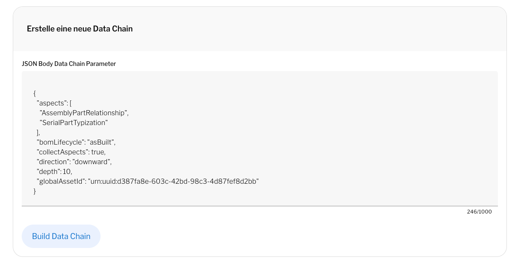
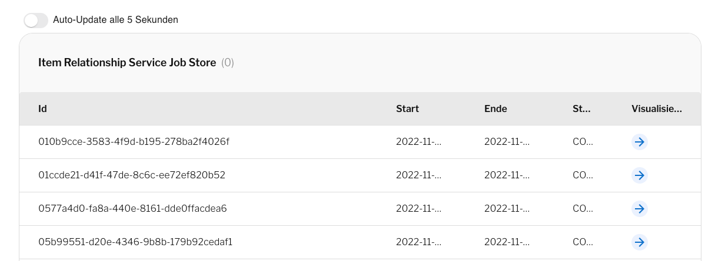
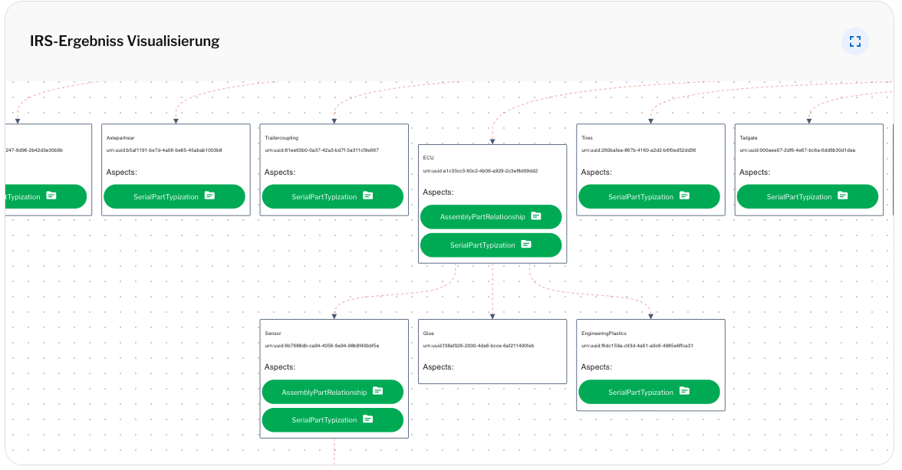
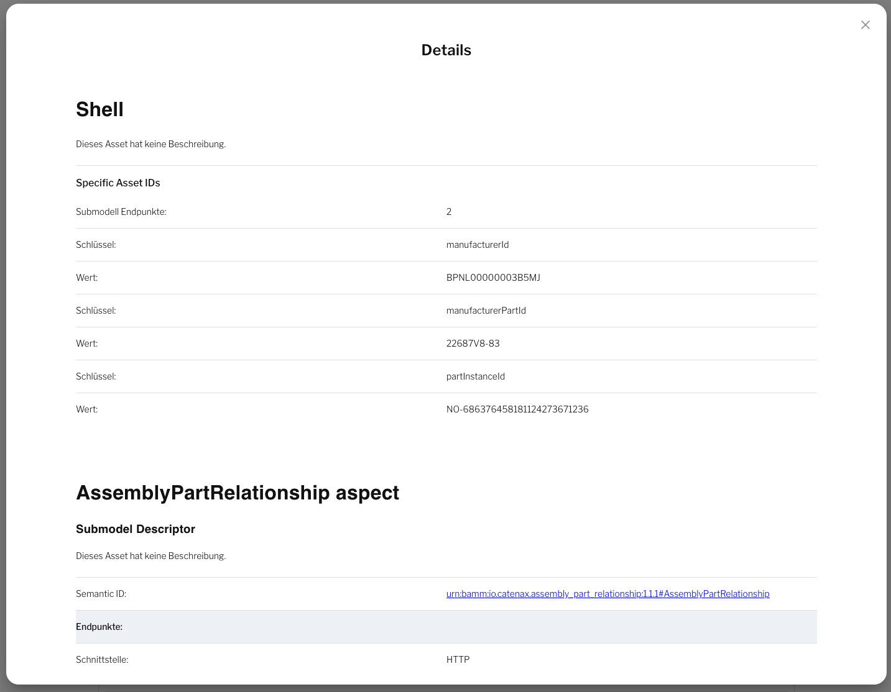

# User Manual

## Prerequisites

* successful deployment of IRS
* A User with the Role _view_irs_

## Getting Started

local deployment

### Login & Logout / Change Environment

### Start a new Tree request

### Show job Info

### Visualization

